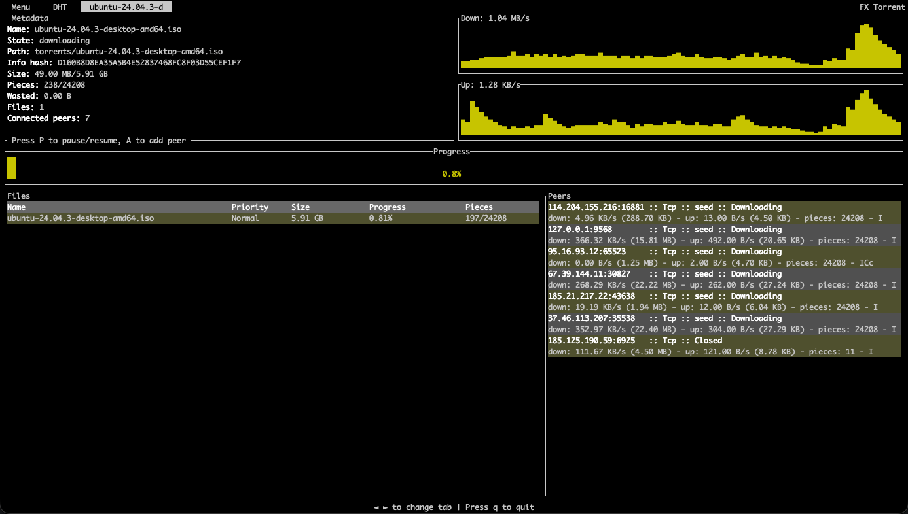
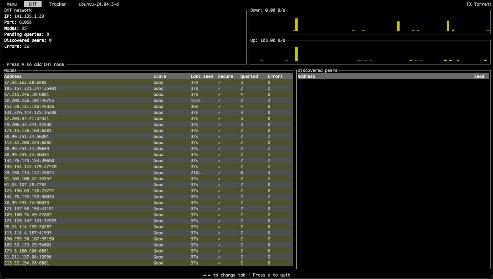

# FX-Torrent


[](https://crates.io/crates/fx-torrent)
[](./LICENSE)
[](https://codecov.io/gh/yoep/fx-torrent)

FX-Torrent is the most complete BitTorrent implementation fully written in Rust, which supports both Linux, MacOS, and Windows.
It supports most of the Bittorrent protocol specifications, such as multi-file torrents, validating existing files, resuming torrent files,
and is based on the `libtorrent` library for functionality and naming convention.

## Getting Started

To use the `fx-torrent` library, add the following cargo dependency:

_Cargo.toml_

```toml
[dependencies]
fx-torrent = "0.1.0"
```

Next, create a new `FXTorrentSession` which manages one or more torrents.
A `Torrent` can be created from a magnet link, torrent file, or passing the raw `TorrentMetadata`.

_create a new session with torrent_

```rust
use fx_torrent::torrents::{FxTorrentSession, TorrentFlags};

// The fx-torrent crate makes use of async tokio runtimes
// this requires that new sessions and torrents need to be created within an async context
#[tokio::main]
async fn main() -> Result<(), io::Error> {
    let session = FxTorrentSession::builder()
        .base_path("/torrent/location/directory")
        .client_name("MyClient")
        .build()
        .unwrap();

    // Create a torrent from a magnet link
    let magnet_torrent = session.session.add_torrent_from_uri("magnet:?XXX", TorrentFlags::default()).await;
    
    // Create a torrent from a torrent file
    let file_torrent = session.session.add_torrent_from_uri("/tmp/example.torrent", TorrentFlags::default()).await;
    
    Ok(())
}
```

### Examples

For more examples, see the [examples](./examples).

### CLI example

The CLI example can be used to download torrents from a magnet link or torrent file.
It uses [Ratatui](https://ratatui.rs/) as the terminal UI library.





## Features

- [x] [BEP3](https://www.bittorrent.org/beps/bep_0003.html) - The BitTorrent Protocol Specification
- [x] [BEP4](https://www.bittorrent.org/beps/bep_0004.html) - Assigned Numbers
- [x] [BEP5](https://www.bittorrent.org/beps/bep_0005.html) - DHT Protocol
- [x] [BEP6](https://www.bittorrent.org/beps/bep_0006.html) - Fast Extension
- [x] [BEP9](https://www.bittorrent.org/beps/bep_0009.html) - Extension for Peers to Send Metadata Files
- [x] [BEP10](https://www.bittorrent.org/beps/bep_0010.html) - Extension Protocol
- [x] [BEP11](https://www.bittorrent.org/beps/bep_0011.html) - Peer Exchange (PEX)
- [x] [BEP12](https://www.bittorrent.org/beps/bep_0012.html) - Multitracker Metadata Extension
- [x] [BEP15](https://www.bittorrent.org/beps/bep_0015.html) - UDP Tracker Protocol for BitTorrent
- [x] [BEP19](https://www.bittorrent.org/beps/bep_0019.html) - WebSeed - HTTP/FTP Seeding (GetRight style)
- [x] [BEP20](https://www.bittorrent.org/beps/bep_0020.html) - Peer ID Conventions
- [x] [BEP21](https://www.bittorrent.org/beps/bep_0021.html) - Extension for partial seeds
- [x] [BEP29](https://www.bittorrent.org/beps/bep_0029.html) - uTorrent transport protocol
- [x] [BEP32](https://www.bittorrent.org/beps/bep_0032.html) - BitTorrent DHT Extensions for IPv6
- [ ] [BEP33](https://www.bittorrent.org/beps/bep_0033.html) - DHT scrape
- [x] [BEP40](https://www.bittorrent.org/beps/bep_0040.html) - Canonical Peer Priority
- [x] [BEP42](https://www.bittorrent.org/beps/bep_0042.html) - DHT Security extension
- [ ] [BEP44](https://www.bittorrent.org/beps/bep_0044.html) - Storing arbitrary data in the DHT
- [x] [BEP47](https://www.bittorrent.org/beps/bep_0047.html) - Padding files and extended file attributes
- [x] [BEP48](https://www.bittorrent.org/beps/bep_0048.html) - Tracker Protocol Extension: Scrape
- [x] [BEP51](https://www.bittorrent.org/beps/bep_0051.html) - DHT Infohash Indexing
- [ ] [BEP52](https://www.bittorrent.org/beps/bep_0052.html) - The BitTorrent Protocol Specification v2 (WIP)
- [x] [BEP53](https://www.bittorrent.org/beps/bep_0053.html) - Magnets
- [x] [BEP54](https://www.bittorrent.org/beps/bep_0054.html) - The lt_donthave extension
- [ ] [BEP55](https://www.bittorrent.org/beps/bep_0055.html) - Holepunch extension (WIP)

## License

This project is licensed under the [Apache-2.0 license](./LICENSE).

### Contribution

Unless you explicitly state otherwise, any contribution intentionally submitted for inclusion in the work by you, as defined in the Apache-2.0 license,
shall be licensed as above, without any additional terms or conditions.
